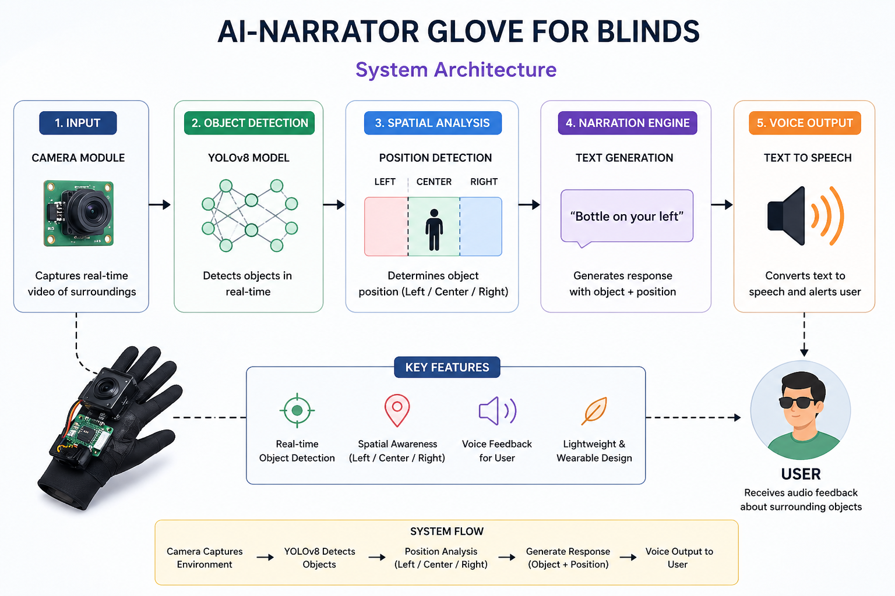

# 🧤 AI-Based Object Detection Glove for the Visually Impaired

An AI-powered assistive system that detects objects in real time and provides voice feedback to help visually impaired individuals navigate their surroundings.

<br>

## 🚀 Features

- Real-time object detection using YOLOv8
- Spatial awareness (Left / Center / Right)
- Voice feedback system
- Assistive AI application

<br>

## 🧠 How It Works

1. Camera captures live video  
2. YOLO model detects objects  
3. Position is calculated  
4. Output generated: "Person on your left"  
5. Voice module speaks the result  

<br>

## 🧩 Architecture



<br>

## 🛠 Tech Stack

- Python
- OpenCV
- YOLOv8
- NumPy
- Text-to-Speech

<br>

## ▶️ Run Project

```bash
pip install -r requirements.txt
python src/main.py
```
<br>

## 🎯 Future Improvements

- Hardware integration
- Mobile version
- Multi-language voice output

<br>

## 📫 Contact

Saranjith S  
Email: saranjith623@gmail.com
